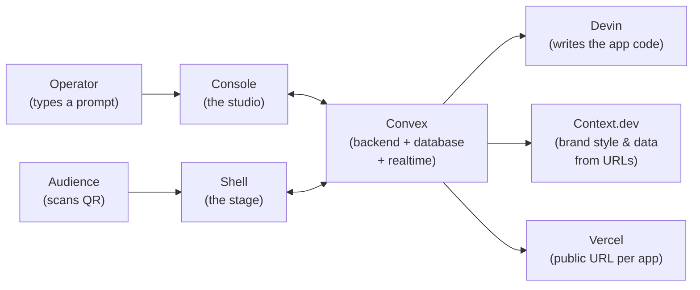
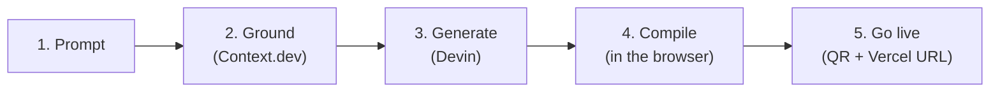

# App Builder — Architecture (High Level)

**What it does:** You describe an app in plain English. Devin writes the code. The platform compiles it, makes it live, and gives you a QR code so anyone can join from their phone — all in a few minutes, with no servers to manage.

---

## The big picture



Five moving parts, one job each:

| Part | Job |
|---|---|
| **Console** (web app) | Where the operator builds: type a prompt, pick capabilities, watch progress, show the QR code. |
| **Shell** (web app) | Where the audience plays: anonymous, loads the generated app, stays live via realtime updates. |
| **Convex** | The entire backend — database, build orchestration, and realtime sync. There is no server of our own. |
| **Devin** | The coding agent. We don't build our own agent; we send Devin a well-prepared prompt and it returns the app's code. |
| **Vercel** | Gives every generated app its own public production URL. |

Supporting roles:
- **Context.dev** grounds the build — it can pull brand styling, data, or docs from a URL you provide, so the generated app looks and feels on-brand.
- **OpenAI** is *not* used to build apps. It's an optional feature *inside* finished apps (e.g. a quiz that generates its own questions), always proxied through our backend so no API key is ever exposed.

---

## How a build works



1. **Prompt** — the operator describes the app and picks capabilities (realtime, grounding, AI).
2. **Ground** — if a URL was given, Context.dev extracts the brand theme and any data from it.
3. **Generate** — Convex composes one rich prompt (our instructions + matching "skill" guides + the grounding) and starts a Devin session. Devin returns the complete app as code.
4. **Compile** — the code is checked and compiled into runnable JavaScript **right in the operator's open browser tab** (no build server needed).
5. **Go live** — the compiled app is saved in Convex, a QR code appears, and a public Vercel URL is created.

---

## How people use the app

Every app is reachable two ways, and the QR code simply encodes one of these links:

- **Shell link** — the shared audience site loads the app's code from Convex on the fly. Always shows the latest version; if the operator ships an update, every open phone hot-swaps instantly.
- **Vercel link** — a standalone one-page deployment of the app, one per project, for a stable public URL.

Either way, all live interaction (scores, votes, presence, timers) flows through Convex in realtime — that's what makes a room full of phones stay in sync.

---

## Safety in one paragraph

Generated code runs in a locked sandbox: it can only use our approved building blocks (the runtime SDK and UI kit), it runs inside a restricted iframe, and anything sensitive (Devin, OpenAI, Vercel, Context.dev keys) lives only in the backend. The builder console is public and the audience never needs an account.

---

## Where things live in the repo

```text
app-builder/
├── convex/       # the backend (build pipeline, realtime, integrations)
├── apps/console/ # operator studio
├── apps/shell/   # audience stage
├── packages/     # runtime SDK + UI kit that generated apps use
├── skills/       # the instruction library we feed to Devin
└── scripts/      # deploy & maintenance commands
```
